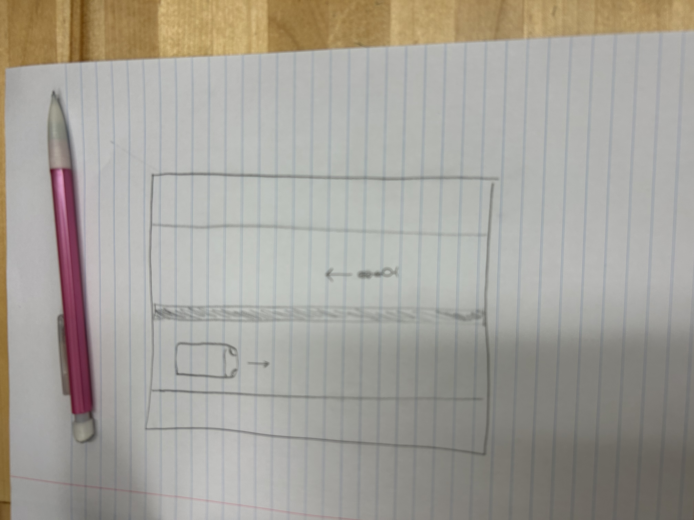

:warning: Everything between << >> needs to be replaced (remove << >> after replacing)

# << Project Title >>
## CS110 B1 Final Project  << Semester, Year >>

## Team Members

Max and Sam

***

## Project Description

This is going to be a project where the user controls a bike and tries to avoid incoming traffic. The user control the bike with arrow keys, and if the human and the bike touch then the game ends. It's a 2-D game.

***    

## GUI Design

### Initial Design

### Final Design

## Program Design

### Features

1. Movable character
2. Obstacle collisions
3. Moving objects
4. Increasing difficulty
5. Gave over screen

### Classes

- << You should have a list of each of your classes with a description >>

## ATP

| Step                 |Procedure             |Expected Results                   |
|----------------------|:--------------------:|----------------------------------:|
|  1                   | Run Counter Program  |GUI window appears with count = 0  |
|  2                   | click count button   | display changes to count = 1      |
etc...

Test case 1: Player Movement
Test Description: Verify the car moves left and right
Test Steps: 
1. Start game
2. Press the left arrow key.
3. car moves left.
4. Press the right arrow key.
5. car moves right

Test case 2: Collision Detection
Test Description: Ensure that collisions between the player's vehicals are detected correctly.
Test Steps:
1. Start the game.
2. Crash two vehicals
3. verify the game ends
Expected Outcome: Game should end and collision is detected

Test case 3: Increasing difficulty
Test Description: Ensure that the speed of car increases as you level up
Test Steps:
1. Start the game
2. Play until you crash
3. Verify the car increases speed
Expected outcome: Car speed should increase as you level up

Test case 4: Gave over
Test Description: Confirm that the game ends when the player crashes
Test Steps:
1. Start the game.
2. Play until the player crashes
3. Verify that the game ends
Expected Outcome: The game should end
when the player crashes

Test case 5: Creates player and enemy
Test Description: Confirm the player and enemy are created when the game starts
Test Steps:
1. Start the game
2. Make sure the player and enemy are created and shown on the screen
Expected outcome: The game should display both the player and the enemy

